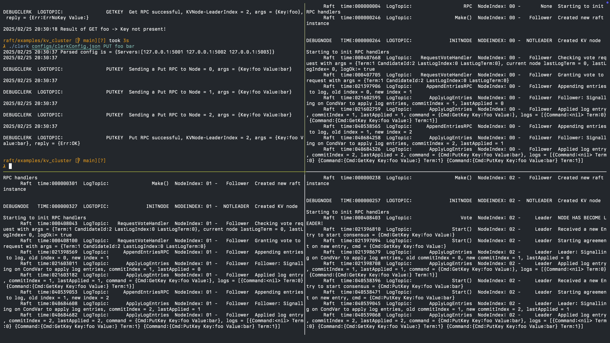

# Raft

A raft library written in Go, adapted from MIT's Distributed Systems Labs ([Link](https://github.com/anirudhsudhir/mit_dist_sys_labs)).

This library utilises the RPC package from Go's standard library ([net/rpc](https://pkg.go.dev/net/rpc)).

## Usage

To use the library, refer to the distrbuted key-value store implementation in the `examples` directory ([examples/kv_cluster/README.md](examples/kv_cluster/README.md)).

### Distributed key-value store implemented using the library

## Todo

- Serialize and persist `currentTerm`, `votedFor` and `logs[]` to disk.
