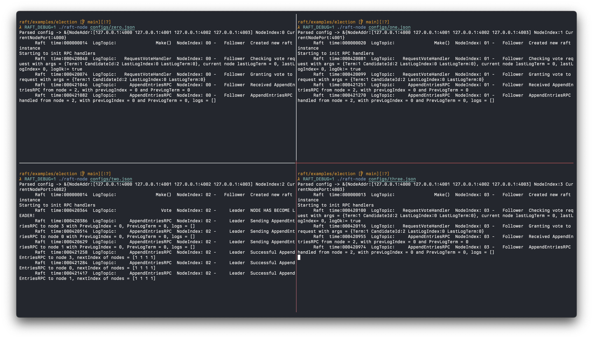

# Examples: Four node leader election

Run four Raft nodes.

This example displays the leader election and heartbeats mechanism.

## Notes

1. The node configurations are stored in the `configs/` directory.

2. Set the `RAFT_DEBUG=1` environment variable to view the Raft logs.

## Usage

1. Build the binary

```sh
make
```

2. Run nodes in different terminal sessions

```sh
# Node 0
RAFT_DEBUG=1 ./raft-node configs/zero.json

# Node 1
RAFT_DEBUG=1 ./raft-node configs/one.json

# Node 2
RAFT_DEBUG=1 ./raft-node configs/two.json

# Node 3
RAFT_DEBUG=1 ./raft-node configs/three.json
```


